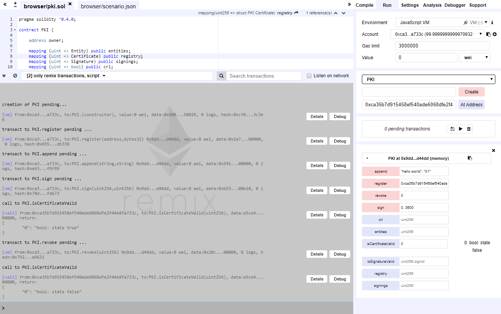
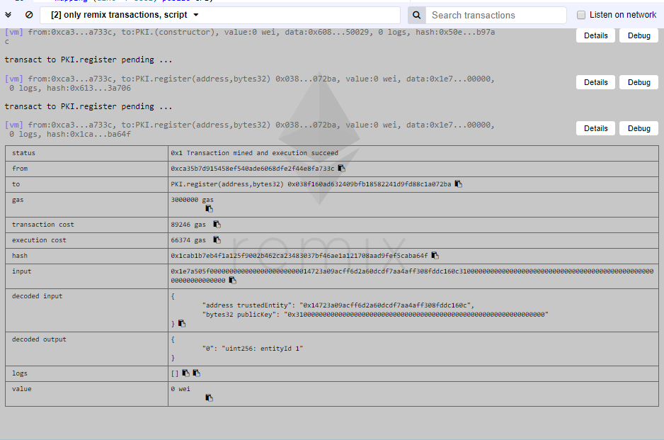
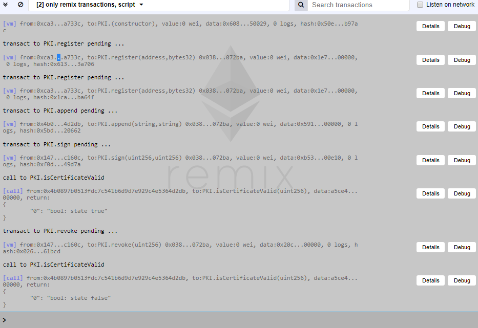

# PKI implementation on a blockchain

This project aims to implement the tools of a PKI on a blockchain like [Ethereum](https://www.ethereum.org).

## Readings

Here are two articles that helped us building our contract:

 - [PKI Tools in EVM-based Blockchains](https://github.com/WebOfTrustInfo/rebooting-the-web-of-trust/blob/master/topics-and-advance-readings/pki_tools_in_evm_blockchains.md) by [@christianlundkvist](https://github.com/christianlundkvist)
 - [Privacy based decntralized Public Key Infrastructure (PKI) implementation using Smart contract in Blockchain](https://isrdc.iitb.ac.in/blockchain/workshops/2017-iitb/papers/paper-11%20-%20Decentralized%20PKI%20in%20blockchain%20and%20Smart%20contract.pdf) by Sivakumar P. and Dr. Kunwar Singh

## Tools

 - [Remix](https://remix.ethereum.org/), a Solidity IDE
 - [Solidity documentation](http://solidity.readthedocs.io/en/develop/index.html)

## Results

The contract is available [here](pki.sol). It has been tested on [Remix](https://remix.ethereum.org/), on two scenarios.

### 1st scenario: only one entity

The JSON file of the scenario is available [here](scenario_simple.json).

In this scenario, the owner of the API is the address 0xca35b7d915458ef540ade6068dfe2f44e8fa733c. Then he registers himself with another transaction, append his certificate and signs it.

We then see that the output of `isCertificateValid` is `true`. The certificate is then revoked, and the output is now `false`.

### 2nd scenario: three entities

The JSON file of the scenario is available [here](scenario_advanced.json).

Here the owner of the PKI contract, 0xca35b7d915458ef540ade6068dfe2f44e8fa733c, registers himself and then another entity, 0x4b0897b0513fdc7c541b6d9d7e929c4e5364d2db, which has then level 1.

A third entity, 0x14723a09acff6d2a60dcdf7aa4aff308fddc160c,appends a certificate which is then signed by 0x4b0897b0513fdc7c541b6d9d7e929c4e5364d2db, the level 1 entity. Then the certificated is tested, revoked and re-tested as in the first scenario.

## Todo-list

 - [x] Proceed advanced testing
 - [x] Ensure security and privacy
 - [ ] JavaScript API?
